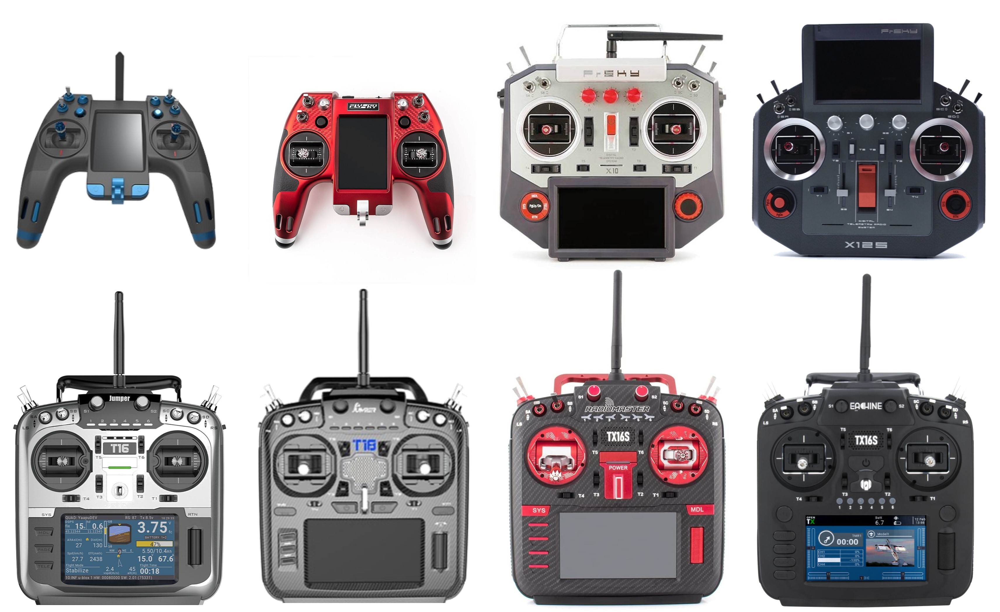

# Användarmanual för sändare med färgskärm

<figure><figcaption>
Sändare med färgskärm som stöds av EdgeTX
</figcaption></figure>

EdgeTX stödjer följande sändare med färgskärm:

* FlySky NV14 / EL18
* FrSky X10 / X10S / X10 Express / X10S Express
* FrSky X12S / X12S-IRSM
* Jumper T16 / T16 Plus / T16 Pro Hall
* Jumper T18 / T18 Lite / T18 Pro
* RadioMaster/Eachine TX16S / RadioMaster TX16S MAX / RadioMaster TX16S Mark II
