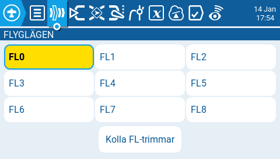
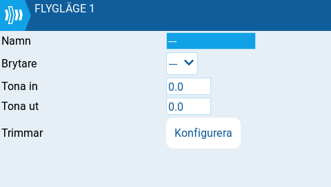
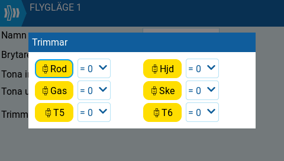

# Flyglägen

<figure><figcaption>
Flyglägen
</figcaption></figure>

Flyglägen gör det möjligt att ha olika trimmar inställda för varje flygläge. När multipla flyglägen har konfigurerats kan trimminställningarna justeras för varje flygläge individuellt, utan att trimmarna för de andra flyglägena påverkas (om de konfigurerats att göra det). Det går att konfigurera upp till 9 olika flyglägen, numrerade från 0 till 8. Flygläge 0 är förvalt (default).

Skärmen **Flyglägen** har en knapp för varje flygläge. Aktivt flygläge är markerad med gult. När ett flygläge väljs, aktiveras en skärm med inställningsmöjligheter för detta flygläge.&#x20;

**Kolla FL-trimmar:** Denna knapp inaktiverar tillfälligt de trimmar som är inställda för aktuellt flygläge. Därigenom kan effekten av inställda trimmar testas.

<figure><figcaption>
Konfiguration av flyglägen
</figcaption></figure>

Skärmen för konfiguration av flyglägen har följande inställningar:

**Namn:** Valbart namn för flygläget. Om ett namn anges kommer det att visas på radions huvudvy, längst ner i mitten mellan trimmarna.

**Brytare:** Brytaren som aktiverar flygläget. Denna kan vara en brytare, ett vred, reglage, telemetrivärde eller en logisk brytare.

**Tona in:** Gradvis ändra trimmvärdet när flygläget aktiveras. Ange tiden i sekunder (0.0 - 25.0) tills värdet ska vara uppnått.

**Tona ut:** Gradvis ändra trimmvärdet när flygläget inaktiveras. Ange tiden i sekunder (0.0 - 25.0) tills värdet ska vara uppnått.

**Trimmar:** När **Konfigurera** valts visas nedanstående skärm för inställningar av flyglägets trimmar.

<figure><figcaption>
Trimminställningar för flyglägen
</figcaption></figure>

För att konfigurera trimmarna, välj den trimm du vill ändra för att säkerställa att den är aktiverad (gul). Välj sedan det flygläge som ska styra det initial trimmvärdet och en modifierare (**=** eller **+**) från drop-downmenyn.

Modifierare - det finns två möjliga modifierare för trimmvärdena, **=** och **+.** Modifieraren **=** använder trimmvärdet direkt från det valda flygläget. Modifieraren **+** använder trimmvärdet från det valda flygläget och adderar sedan det trimmvärde som angetts för det flygläge som konfigureras.

_Exempel 1:_ Om du konfigurerar FL1 och sätter värdet till =0, kommer trimmvärdet för FL1 vara detsamma som för FL0. I detta fall kommer en ändring i trimm för FL0 att påverka motsvarande trimm för FL1, och vice versa.

_Exempel 2:_ Om du konfigurerar FL1 och sätter värdet till +0, kommer trimmvärdet för FL1 vara detsamma som för FL0 _plus_ eventuellt trimmvärde för FL1. I detta fall kommer en ändring i trimm för FL1 inte påverka motsvarande trimm för FL1. Däremot kommer en ändring i trimm för FL0 att påverka trimmen för FL1.


Om en trimm är avstängd (vit) under Trimmar, kan den trimmen _inte_ justeras från huvudvyn.

