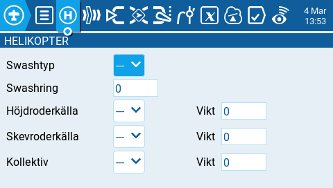

# Helikopterinställningar

Sidan med **Helikopterinställningar** under modellinställningarna är en sida som endast finns tillgänglig om en anpassad version av radions firmware byggts, med det tillägget. Inställningarna används ofta för kollektiv pitch-mixning (CPPM) för helikoptrar med flybar, där mottagaren direkt kontrollerar swashringens servon. De flesta helikoptrar utan flybar behöver inte konfigureras med dessa inställningar. Output från CPPM-mixern är CYK1, CYK2 och CYK3, vilka behöver tilldelas en utdatakanal på sidan för Mixar.

<figure><figcaption>
Helikopterinställningar
</figcaption></figure>

Följande inställningsmöjligheter finns:

* **Swashtyp** - Swashtyp för modellen. Alternativen är **120, 120x, 140** och **90.**
* **Swashring** - Sätter gränsen för swashringen. **1** = maximal gräns -> **100,** eller **0** = ingen gräns.
* **Höjdroderkälla** - Välj källans input.
* **Skevroderkälla** - Välj källans input.
* **Kollektiv** - Välj källans input.
* **Vikt** - Procentandel av spakens omfång som används.
