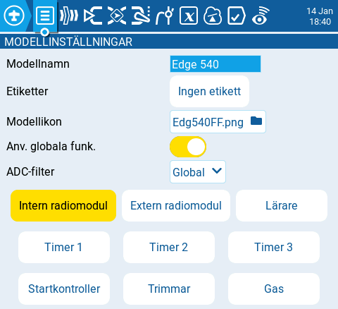

# Modellinställningar

<figure><figcaption>
Modellinställningar
</figcaption></figure>

Huvudsidan **Modellinställningar** är den sida där du påbörjar inställningar av din modell. Den innehåller följande:

#### Modellnamn

Ange önskat namn för modellen. Maximalt 15 tecken kan anges.

#### Etiketter

Här kan du sätta etiketter på modellen, från listan med befintliga etiketter. Etiketten **Utan etikett** är förvald**.** Mer information om hur etiketter hanteras finns på sidan [Välj modell](../../select-model.md).

#### Modellikon

När katalogikonen väljs visas ett popupfönster där du kan välja en bild från bildkatalogen (IMAGES) på radions SD-kort.


För att undvika prestandaproblem bör bildfilerna inte vara större än 192 x 114 pixlar.



På [https://www.skyraccoon.com/](https://www.skyraccoon.com/) finns ett stort antal öppna modellbildfiler som kan användas med EdgeTX.


#### Använda globala funktioner

När inställningen är aktiverad kommer de globala funktioner som finns konfigurerade i radion att gälla för denna modell. Om inställningen är inaktiverad gäller de inte för modellen.


_Globala funktioner_ är _specialfunktioner_ som kan appliceras för alla modeller på radion. Se [Specialfunktioner](../special-functions.md) för information om hur dessa kan konfigureras.


#### ADC-filter

Aktiverar/inaktiverar ADC-filtret för den specifika modellen. Alternativet _**global**_ antar det värde som satts i radions [hårdvaruinställningar](../../radio-settings/hardware.md), vilket är _På_ som förvalt värde.


ADC-filtret är ett filter för de proportionella kanalerna (spakar, vred och reglage) som jämnar ut små snabba ändringar som kan uppstå på grund av störningar i systemelektroniken. Normalt sett ska detta filter vara _Av_ för modeller med "flight controllers".

