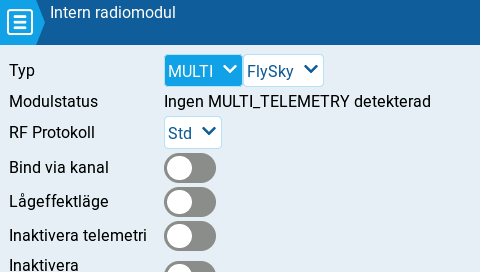
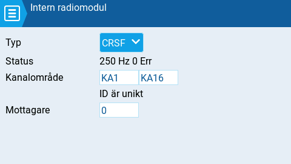

# Intern / Extern radiomodul

Sidorna för konfigurationsinställningar av såväl intern och extern radiomodul fungerar likadant. Den enda skillnaden är att delen för **Intern radiomodul** är för konfiguration av den inbyggda radio-modulen medan delen för **Extern radiomodul** är för konfiguration av en extern radiomodul.

Den interna eller externa radiomodulen är aktiv för en modell när knappen är gul och inaktiv när den är vit.

<figure><figcaption>
Intern radiomodul med multiprotokoll vald
</figcaption></figure>

 

<figure><figcaption>
Internal radiomodul med Crossfire (CRSF) vald
</figcaption></figure>

Konfigurationsinställningarna är **Av** eller namnet på **typen av modul** enligt inställningarna för radions [hårdvara](../../radio-settings/hardware.md). Tillgängliga alternativ för inställningar av radiomodulen varierar med varje installerad typ av modul. Vi hänvisar till respektive tillverkares dokumentation för mer information om de olika alternativen.


Konfigurationsinställningarna för multiprotokollmodulen finns här: [https://www.multi-module.org/using-the-module/protocol-options](https://www.multi-module.org/using-the-module/protocol-options)


#### Mottagarnummer

Mottagarens nummer är en användarvald siffra för en modell, som skickas till mottagaren när den binds (parkopplas) med sändaren. Varje modell måste i regel ha ett unikt mottagarnummer men modeller som använder olika protokoll kan ha samma nummer utan problem. EdgeTX informerar om mottagarnumret är unikt eller om det redan används, med en text ovanför nummerfältet.


Om radion ska användas som spelkontroll bör såväl den interna som externa radiomodulen stängas av. Detta resulterar i bättre prestanda när radion är ansluten till en dator via USB.

