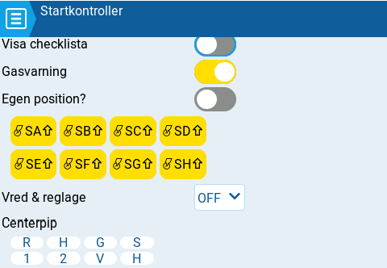

# Startkontroller

<figure><figcaption>
Preflight Checks page
</figcaption></figure>

Varje gång en ny modell laddas i EdgeTX görs startkontroller enligt inställningarna på denna sida. Om någon av kontrollerna misslyckas ges en ljudlig och visuell varning, som måste bekräftas innan modellen kan användas. Följande startkontroller kan konfigureras:

**Visa checklista** - När denna kontroll är aktiverad kommer modellanteckningarna för modellen att visas när modellen laddas. En giltig anteckningsfil måste finnas i SD-kortets mapp **Models.** Modellanteckningarna måste vara en .txt-fil och ha exakt samma namn som själva modellen (exempel FunCub.txt för en modell med namn FunCub). Innehållet i textfilen är valfritt och upp till användaren att bestämma.

**Gasvarning** - När denna kontroll är aktiverad kommer radion att kontrollera att gasen är i sitt lägsta läge, för den kanal som är konfigurerad som gas i menyn [Gas](throttle.md).

**Egen position?** - Om denna kontroll är aktiverad visas en textruta där ett siffervärde kan anges, mot vilken gasens läge kontrolleras.

**Brytare** - Denna del av skärmen visar alla brytare som är konfigurerade på radion och ger användaren en möjlighet att ange vilket brytarläge som är korrekt för kontroll av brytarna. När brytaren väljs kan alla lägen för brytaren stegas igenom eller brytarkontrollen stängas av helt. Gulmarkerade brytare har kontrollen aktiverad medan för vitmarkerade brytare är kontrollen avstängd.

**Vred och reglage** - När denna kontroll är aktiverad kontrolleras läget för radions vred och reglage. Det finns tre alternativ - AV, PÅ och AUTO. När PÅ eller AUTO är vald visas knappar med radions vred och reglage.

* **Av** - Vred och reglage kontrolleras inte.
* **På** - Lägena för vred och reglage kontrolleras mot manuellt konfigurerade lägen för de vred och reglage som aktiva (gulmarkerade). För att manuellt ställa in läget, välj PÅ i drop-downmenyn, ställ in önskat lägena för vred och reglage och aktivera kontrollen genom att välja dem (gulmarkerade).
* **Auto** - Läget för aktiverade vred och reglage kontrolleras mot deras senast sparade läge, innan radion stängdes av eller anna modell valdes.

**Centerpip** - Ger möjligheten att slå av/på mittpip för individuella spakar, vred och reglage, genom att välja dem (gulmarkerade).
