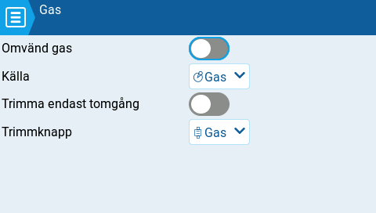

# Gas

<figure><figcaption>
Inställningar för gas
</figcaption></figure>

I EdgeTX finns möjligheten att ange en specifik källa och trim för modellens gas (trottel). Följande inställningsmöjligheter finns:

**Omvänd gas:** Om detta alternativ är aktiverat inverteras riktningen för den konfigurerade gaskanalen.

**Källa:** Källan som används till gasen.

**Trimma endast tomgång**: Om detta alternativ är aktiverat kommer gastrimmen endast att påverka den nedre delen av gasens omfång.


Till exempel: med **Trimma endast tomgång** aktiverad kan gasspaken i nedre läget ha ett värde -80 medan mittläget har värdet 0 och översta läget värdet 100. Om **Trimma endast tomgång** i stället är inaktiverat kan gasspaken i nedre läget ha ett värde av -80 medan mittläget har värdet 20 och översta läget värdet 100.&#x20;


**Trimmknapp:** Knappen som används för att trimma gasen. Det är möjligt att ersätta gasens trimmknapp med någon annan av radions trimmknappar, exempelvis de för skev-, sid- eller höjdrodren.
