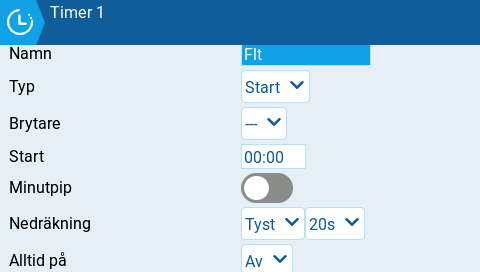

# Timer 1/2/3

<figure><figcaption>
Konfiguration av timer
</figcaption></figure>

EdgeTX har 3 timers (tidtagare) som var och en kan konfigureras individuellt. Följande konfigureringsalternativ finns:

**Namn:** Namnet på timern

**Typ**:

* **Av** - Timern används inte
* **På \*\*\*** - Timern är på så länge som konfigurerad brytare är aktiv. Timern stoppas när brytaren inaktiveras.
* **Start** \*\*\* - Timern är på hela tiden oavsett brytarens läge.
* **Gas** - Timern startar när gasen höjs över noll och konfigurerad brytare är aktiv. Timern stoppar antingen när gasen sänks till noll eller brytaren inaktiveras.
* **Gas %** - Timern är på och räknas upp proportionellt i förhållande till gasläget. Vid full gas är förhållandet 1/1 (reell tid) och vid halv gas 1/2 (50%).
* **Gas Start** - Timern startar när gasen höjs över noll och konfigurerad brytare är aktiv. Därefter är timern på så länge brytaren är aktiv, oavsett gasläget.


**Gas**, **Gas % och Gas Start** kan aktiveras av en brytare (även en logisk brytare), vred eller värdet av en annan kanal än gaskanalen. Detta specificeras i fältet **Gaskälla** i sektionen [throttle.md](throttle.md "mention") in **Modellinställningar**.


**Brytare -** Ange den brytare som ska trigga att timern startar. Om ingen brytare är vald triggas timern enbart beroende på dess typ. Utöver en brytare kan du även ange en trimmer, telemetrikälla (som triggas när data tas emot från källan) eller endera slags fysisk aktivitet (en spak som rörs eller en knapptryckning, kallad **Act)**.


De poster som har ett "!" före brytarnamnet betyder att villkoret är inverterat. \
Till exempel: "!SA-" betyder "när brytare SA inte är i sin mitten/centerposition", det vill säga den antingen är upp eller ner.


**Start -** Tiden som avänds för timerns avancerade funktioner. Förvald tid är 00:00 och om den lämnas oförändrad fungerar timern som ett stoppur, som räknar upp tills den stoppas. Om en annan tid än 00:00 anges i startfältet, visas ett nytt flervalsfält **Riktning**.

**Riktning** - Om satt till **Visa återstående** kommer timern att räkna neråt från angiven tid ner till noll och därefter varna användaren. Om den är satt till **Visa förbrukad** fungerar timern som ett alarm, genom att räkna upp från noll till angiven tid och därefter varna användaren.

**Minutpip** - Om minutpip är aktiverat kommer du bli meddelad när varje minut passerat, som beskrivet under **Nedräkning**.

**Nedräkning:**

* **Tyst** - Inga meddelanden ges förrän timern nått noll. Då avges ett enda pip.
* **Pip** - Radion kommer pipa varje sekund, med start vid angiven kvarvarande tid.
* **Röst** - Radion kommer räkna ner varje sekund, med start vid angiven kvarvarande tid.
* **Vibrera** - Radion kommer vibrera varje sekund, med start vid angiven kvarvarande tid.

**Alltid på:**

* **Av** - Timern återställs vid ett modellbyte, eller när radion stängs av/på.
* **Flygning** - Timern återställs INTE vid ett modellbyte eller när radion stängs av/på. Timern återställs endast när **Återställ flygning** väljs i huvudmenyn [Återställ telemetri](../../reset-telemetry.md).
* **Nolla själv -** Timern återställs endast när återställning av den individuella timern väljs i huvudmenyn [Återställ telemetri](../../reset-telemetry.md).


Inställningen **Alltid på - Flygning** kan anges för flera timers. Därmed kan dessa återställas samtidigt med valet **Återställ flygning**.

