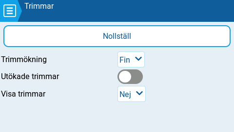

# Trimmar

<figure><figcaption>
Trims settings page
</figcaption></figure>

Trimmar används för att justera mittpositionen för en enskild spakaxel. EdgeTX har följande alternativ för inställning av trimmarna:

**Nollställ** - Återställer alla trimmar till noll.

**Trimökning:** Definierar storleken på ökning/minskning av trimmen när trimknappen används.

* Grov = 1.6%
* Medium = 0.8%
* Fin = 0.4%
* Extra fin = 0.2%
* Exponentiell = 0.2% nära centrum och sedan ökar stegvärdet exponentiellt med avståndet från trimmens centrum.

**Utökade trimmar**: Ökar maximalt omfång på trimmen från **±**25% till **±**100%.


När byte görs från utökade trimmar till normala trimmar, kommer det utökade trimvärdet att kvarstå tills trimmen justeras igen. Först då kommer värdet att hoppa till det normala maximala/minimala trimvärdet.


**Visa trimmar:** När denna är satt till **Ja**, kommer trimmens numeriska värde att visas på trimstapeln på radions huvudvy. När den är satt till **Ändring** visas trimmens numeriska värde endast om det inte är noll.
