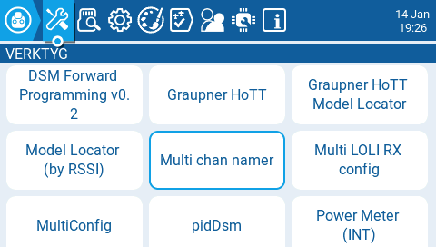
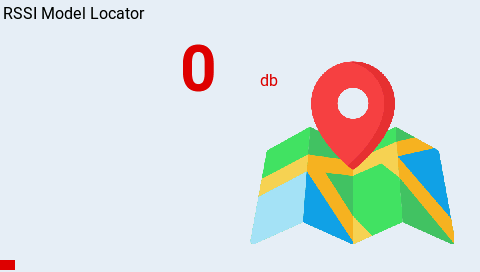
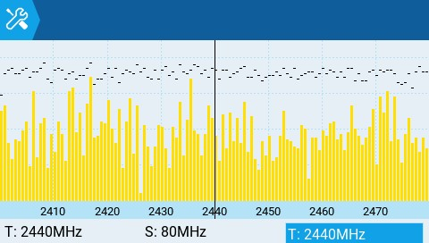
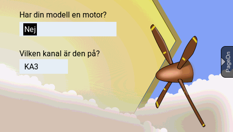

# Verktyg

<figure><figcaption>
Skärmen för Verktyg
</figcaption></figure>

På radioinställningarnas sida för **Verktyg** kan ett antal Lua-baserade skript väljas och köras. De Lua-skript som visas är de som finns på radions SD-kort i mappen **Tools**. När ett skript väljs körs det i helskärmsläge. Det finns några Lua-skript som är standard i EdgeTX och följer med vid installation men ytterligare verktyg kan laddas ner och läggas till på SD-kortet.&#x20;

Följande verktyg är inkluderade som standard i EdgeTX:

#### Lokalisera modell (med RSSI)

<figure><figcaption>
Verktyget Lokalisera modell
</figcaption></figure>

Modelllokaliseraren kan användas som hjälpmedel för att hitta en försvunnen modell, baserat på signalstyrkan (RSSI), om en signal från modellen fortfarande finns. Widgeten skapar en ljudsignal (likt en variometer) och visar RSSI-värdet i färgsatta staplar (0-100%), vilket kan användas för att pendla in riktningen till modellen. Om en riktning tas ut från två eller fler olika platser kan modellens position trianguleras, så att en mer exakt position kan estimeras för den.

#### Spektrum (INT)

<figure><figcaption>
Verktyget för spektrumanalys (INT)
</figcaption></figure>

Verktyget för spektrumanalys visar signalstyrkan i spektrumbandet 2.4GHz. Verktyget använder den interna MULTI-modulen för spektrumanalysen.

Displayen visar frekvenser kring 2.4GHz, från 2400MHz till 2480MHz. Den horisontella axeln visar frekvensen i MHz och den vertikala axeln visar den relativa signalstyrkan.

**T:** Frekvensen för diagrammets mitt (låst till 2440MHz)\
**S:** Bandbredd för diagrammet (låst till 80MHz)\
**T:** Markörens position (den vertikala linjen)

Genom att trycka **ENT** och skrolla vänster eller höger kan T-värdet ändras, vilket flyttar den vertikala linjen till vald frekvens.

#### Modellguiden (Wizard Loader)

<figure><figcaption>
Modellguiden för flygplan
</figcaption></figure>

Modellguiden hjälper dig att göra inställningar för en ny modell av en viss typ: flygplan, segelflygplan, quadkopter eller helikopter. När modelltypen väl har valts, tar guiden dig igenom ett antal frågebaserade steg för olika inställningar av modellen, baserade på de svar som ges.

_**OBS! Modellguiden skapar inte en ny modell utan konfigurerar den aktiva (valda) modellen. Skapa först manuellt en ny modell och kör därefter modellguiden. Om modellguiden körs på en redan konfigurerad modell kommer inställningarna för den modellen att skrivas över!**_


Ytterligare Lua-skript för EdgeTX kan laddas ner från: [https://github.com/EdgeTX/lua-scripts](https://github.com/EdgeTX/lua-scripts)

