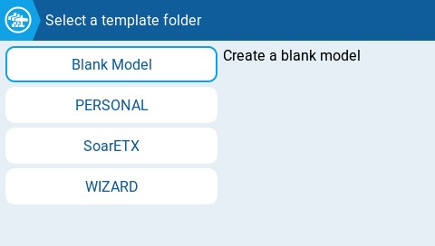
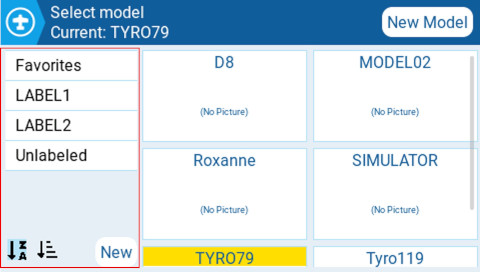

# Välj modell

Skärmen Välj modell ger dig möjlighet att skapa nya modeller, välja aktiv modell, skapa och sätta modelletiketter samt skapa modellmallar.

### Välj modell

<figure><figcaption>
Välj modell
</figcaption></figure>

Aktiv modell är markerad (med gult i detta fall). Att dubbelklicka på en aktiv modell ger dig följande alternativ:

* **Duplicera modell** - skapar en exakt kopia av den aktiva modellen, med samma namn. Ändringar av modellnamn eller andra inställningar kan göras i [Model Settings](model-settings/model-setup/).
* **Redigera etiketter** - When this option is selected, all configured labels will be displayed and can be selected for this model. More Information about [Model Labels](select-model.md#model-labels) is below.
* **Spara som mall** - this option saves a copy of the model as a model template.


Changes to models that were saved as templates do not update the templates themselves.


Double-tapping on an unselected model (unhighlighted) will give you the following options:

* **Select model** - this option selects this model as the selected model (active model).
* **Duplicate model** - same as described above.
* **Delete model** - this option moves the model to the deleted folder on the SD Card. _Only models that are not selected can be deleted._
* \*\*Edit Labels \*\*_\*\*\*\*_ - same as described above.
* **Save as template** - same as described above.

### New Model

To create a new model, select the **New Model** button in the upper right corner. You will then be presented with the following options:

<figure><figcaption>
New model options
</figcaption></figure>

* **Blank Model** - This will create a blank model with only the default options configured.
* **PERSONAL** - This option will allow you to select one of your saved model templates and then create a copy of it as a new model.
* **SoarETX** - This will display pre-configured model templates for radio-controlled model sailplanes.
* **WIZARD** - This will launch the new model wizard and create the model as configured in the wizard.

### Model Labels

Model labels allow you to give each model one or more labels. You are then able to filter the models displayed in the **Model Select** screen based on the labels that you select. This allows people with many configured models to find them easier. By default, the **Favorites** andU**Unlabeled** labels are created automatically. All models are considered **unlabeled** until a label is applied to them.

<figure><figcaption>
Model label filters and sorting
</figcaption></figure>

#### Creating new model labels

To create a new model label, select the **New** button on the bottom left of the screen. The **Enter Label** pop-up will appear and you can enter the desired label name. Select **Save** to save the new label.

#### Assigning labels to models

To assign a label to a model, double-tap an unselected model and then select **Edit Labels**. Once selected, all configured labels will be displayed and one or more labels can be selected for this model. Labels applied to the model will be designated with a _**check**_\*\* \*\* icon.

#### Applying and sorting model label filters

To apply a model label filter, select the filter or filters from the left column. It will automatically filter out the models that do not have those model labels.

The icons below the label list are for sorting the filtered models. Either alphabetically or by last time selected as described in the image below.

<figure><figcaption>
Sorting icon definitions
</figcaption></figure>
