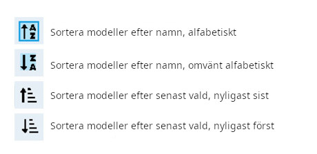

# Välj modell

Skärmen **Välj modell** ger dig möjlighet att skapa nya modeller, välja aktiv modell, skapa och sätta modelletiketter samt skapa modellmallar.

### Välj modell

<figure><figcaption>
Välj modell
</figcaption></figure>

Aktiv modell är överstruken (med gult i detta fall). Att dubbelklicka på en aktiv modell ger dig följande alternativ:

* **Duplicera modell** - skapar en exakt kopia av den aktiva modellen, med samma namn. Ändringar av modellnamn eller andra inställningar kan göras i [Modellinställningar](model-settings/model-setup/).
* **Redigera etiketter** - detta alternativ visar alla befintliga etiketter, vilka sedan kan tilldelas modellen. Mer information om modelletiketter finns nedan under [Modelletiketter](select-model.md#modelletiketter).
* **Spara som mall** - detta alternativ sparar modellen som en modellmall.


Ändringar av modeller som sparats som modellmallar uppdaterar inte själva modellmallarna.


Att dubbelklicka på en icke vald (ej överstruken) modell ger dig följande alternativ:

* **Välj modell** - sätt vald modell till aktiv modell.
* **Duplicera modell** - samma som beskrivits ovan.
* **Radera modell** - flyttar modellen till katalog MODELS/DELETED på SD-kortet. _Endast modeller som inte är aktiva kan raderas._
* **Redigera etiketter** - samma som beskrivits ovan.
* **Spara som mall** - samma som beskrivits ovan.

### Ny modell

För att skapa en ny modell, klicka på **Ny modell** i det övre högra hörnet. Du får därmed följande alternativ:

<figure><figcaption>
Ny modell
</figcaption></figure>

* **Tom modell** - skapar en tom modell med enbart standardinställningar konfigurerade.
* **PERSONAL** - ger dig möjlighet att skapa en ny modell från någon av dina egna sparade modellmallar.
* **SoarETX** - ger dig möjlighet att skapa en ny modell från en av flera förkonfigurerade modellmallar för RC-segelflygplan.
* **STANDARD** - ger dig möjlighet att skapa en ny modell från någon av de standardmodellmallar som finns.
* **WIZARD** - öppnar en modellguide där du kan skapa en ny modell genom att följa instruktionerna i guiden.

### Modelletiketter

Modelletiketter ger dig möjligheten att sätta en eller flera etiketter på varje modell. Du kan sedan filtera vilka modeller som ska visas i **Välj modell**, baserat på vilka etiketter du valt. Detta gör det enklare att hitta en viss modell om du har många modeller i din radio. Två etiketter, **Favoriter** och **Utan etikett** skapas automatiskt. Alla modeller är utan etikett tills minst en etikett har satts på dem.

<figure><figcaption>
Modelletiketter
</figcaption></figure>

#### Skapa ny modelletikett

För att skapa en ny modelletikett, tryck på knappen **Ny** i det nedre vänstra hörnet. En popup **Ange etikett** visas där du kan ange önskad etikett. Välj **Spara** för att spara den nya etiketten.

#### Sätta etiketter på modeller

För att sätta en etikett på en modell, dubbelklicka på en inaktiv modell och välj **Redigera etiketter**. Därefter kan en eller flera etiketter väljas ur den lista med etiketter som visas. Valda etiketter är förbockade i listan.

#### Tillämpa modellfilter och sortera modeller

För att filtera modellerna efter sina etiketter, välj ett eller flera etikettfilter ur den vänstra kolumnen. De modeller som saknar dessa etiketter kommer därmed filtreras bort och inte visas.

Ikonerna under listan med modelletiketter kan användas för att sortera de filtrerade modellerna, enligt bilden nedan.

<figure><figcaption></figcaption></figure>
