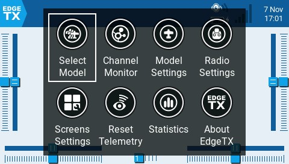

# Användargränssnitt

Det går att navigera i EdgeTX användargränssnitt med fysiska knappar, pekskärm eller en kombination av båda dessa.

<figure><figcaption>
Common buttons for navigation
</figcaption></figure>

### **Knappar:**

* **\[SYS]** - System\
  \*\*\*\*- Tryck på **\[SYS]** för att gå till sidan för [radio-settings](radio-settings/ "mention").
* **\[MDL]** - Modell \*\*\*\*\
  \*\*\*\*- Tryck på **\[MDL]** för att gå till sidan för [model-setup](model-settings/model-setup/ "mention").\
  \- Håll ner **\[MDL]** för att gå till sidan Välj modell.
* **\[RTN] -** Return / Bakåt\
  \- Tryck på **\[RTN]** för att återgå till föregående sida, föregående meny eller för att avbryta aktiviteten.
* **\[PAGE>] / \[PAGE<]** - Nästa sida & Föregående sida\
  \*\*\*\*- Används för att navigera mellan olika skärmar, flikar eller inställningar.
* **\[TELE] -** Telemetri\
  \- Tryck på **\[TELE]** för att gå till sidan för [screen-settings](screen-settings/ "mention").
* **\[Rullhjul]** eller **\[Snurrhjul]** - Nästa och föregående värde.\
  Rullhjulet används för att navigera i de olika menyerna.
* **\[Enter]** - Acceptera\
  \- Används för att välja alternativ, funktion eller acceptera värde\
  \- Tryck på **\[Rullhjul]** eller **\[Snurrhjul]** för att välja eller acceptera.

### **Pekskärm**:

Vissa sändare har en pekskärm. På dessa sändare går det att interagera i menyerna antingen med de fysiska knapparna eller pekskärmen.


Det går att inaktivera pekskärmen genom att konfigurera en specialfunktion. Se [special-functions.md](model-settings/special-functions.md "mention") för mer information.&#x20;


Touch the EdgeTX icon in the upper left corner of the screen to open the main navigation menu. Touch the desired menu option to select it.

<figure><figcaption>
Main navigation menu
</figcaption></figure>


For models that have **Display Checklist** enabled in the [Preflight Checks](model-settings/model-setup/preflight-checks.md) screen and a valid model checklist file in the **Models** folder you will see a **Model Notes** icon instead of the **Channel Monitor** icon.


Pressing the roller from the main screen will also open the main navigation menu. You can then scroll using the roller to the desired menu option and select it by pressing the roller.
