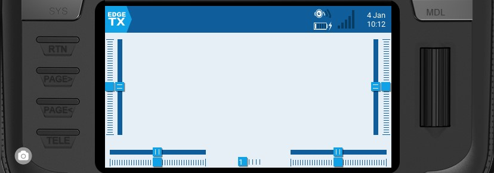
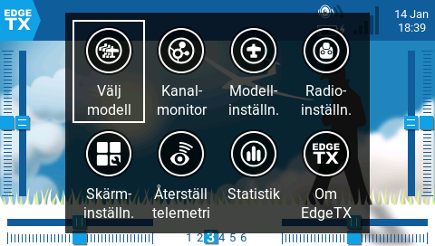

# Användargränssnitt

Det går att navigera i EdgeTX användargränssnitt med fysiska knappar, pekskärm eller en kombination av båda dessa.

<figure><figcaption>
Common buttons for navigation
</figcaption></figure>

### **Knappar:**

* **\[SYS]** - System\
  \*\*\*\*- Tryck på **\[SYS]** för att gå till sidan för [radio-settings](radio-settings/ "mention").
* **\[MDL]** - Modell \*\*\*\*\
  \*\*\*\*- Tryck på **\[MDL]** för att gå till sidan för [model-setup](model-settings/model-setup/ "mention").\
  \- Håll ner **\[MDL]** för att gå till sidan Välj modell.
* **\[RTN] -** Return / Bakåt\
  \- Tryck på **\[RTN]** för att återgå till föregående sida, föregående meny eller för att avbryta aktiviteten.
* **\[PAGE>] / \[PAGE<]** - Nästa sida & Föregående sida\
  \*\*\*\*- Används för att navigera mellan olika skärmar, flikar eller inställningar.
* **\[TELE] -** Telemetri\
  \- Tryck på **\[TELE]** för att gå till sidan för [screen-settings](screen-settings/ "mention").
* **\[Rullhjul]** eller **\[Snurrhjul]** - Nästa och föregående värde.\
  Rullhjulet används för att navigera i de olika menyerna.
* **\[Enter]** - Acceptera\
  \- Används för att välja alternativ, funktion eller acceptera värde\
  \- Tryck på **\[Rullhjul]** eller **\[Snurrhjul]** för att välja eller acceptera.

### **Pekskärm**:

Vissa sändare har en pekskärm. På dessa sändare går det att interagera i menyerna antingen med de fysiska knapparna eller pekskärmen.


Det går att inaktivera pekskärmen genom att konfigurera en specialfunktion. Se [special-functions.md](model-settings/special-functions.md "mention") för mer information.&#x20;


Peka på EdgeTX-ikonen i det över vänstra hörnet av skärmen för att öppna huvudmenyn. Peka på önskad meny för att välja den.

<figure><figcaption>
Huvudmeny
</figcaption></figure>


För modeller som har **Visa checklista** aktiverad på sidan [preflight-checks.md](model-settings/model-setup/preflight-checks.md "mention") och har en giltig fil med en checklista i SD-kortets **Models**-katalog visas en ikon för **Modellanteckningar** istället för en ikon för **Kanalmonitor**.


Att trycka på rullhjulet från huvudskärmen öppnar också huvudmenyn. Du kan sedan skrolla till önskat menyval och välja meny genom att trycka på rullhjulet.
